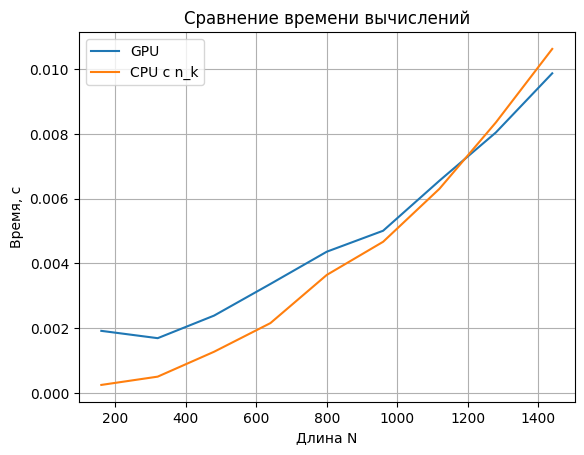
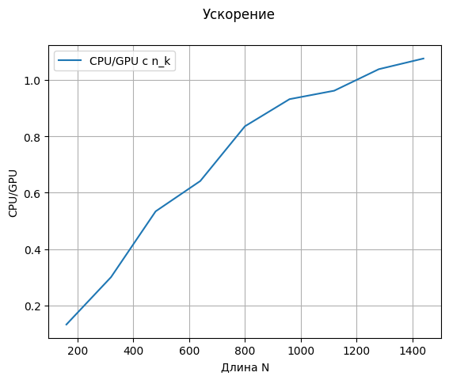

# Предобработка символов алфавита
Создаётся словарь, где ключами выступают символы алфавита, а значениями — кортежи вида (n, k). Здесь n — индекс подстроки N[n], а k — индекс символа внутри этой подстроки. Для каждого символа N[n, k] в словарь добавляется соответствующий кортеж (n, k).

# GPU реализация
Каждый поток с индексами x и y обрабатывает символы подстроки N[y] для символа H[x] входного буфера. Если символ подстроки с индексом k совпадает с символом H[x], то элемент рабочей матрицы R[y, x - k] уменьшается на единицу.

# CPU реализация
Для каждого символа входного буфера H извлекаются его позиции (n, k) в подстроках. Для каждой найденной пары (n, k) значение R[n, i - k] уменьшается на единицу.

## Вывод
Массовый поиск подстрок с использованием стандартных средств Python значительно уступает по скорости распараллеленной реализации с помощью Numba. Предобработка с использованием (n, k) существенно ускорила CPU-реализацию, однако GPU-реализация, несмотря на дополнительные затраты на передачу данных, показала наивысшую производительность благодаря использованию большого количества потоков.