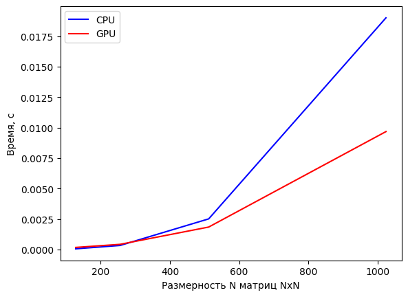
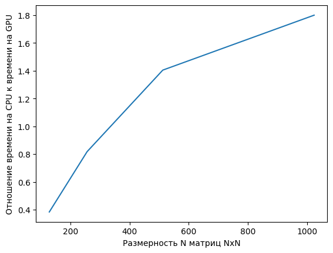

## Задание

__Задача__: реализовать алгоритм перемножения матриц

__Язык__: C++ или Python

__Входные данные__: 2 матрицы размером от 100х100 до 2000х2000 каждая.

__Выходные данные__: проверка корректности перемножения + время вычисления

__Реализация должна содержать 2 функции перемножения матриц__: на CPU и на GPU с
применением CUDA.

__Отчет о проделанной лабораторной работе__ - это git-репозиторий с исходным кодом реализации + описание проделанной работы там же в readme.
Необходимо описать реализацию, объяснив, что конкретно было распараллелено и почему.

__Провести эксперименты__: перемножить матрицы разных размеров, посчитать ускорение. Результаты привести в виде таблицы/графика.

## Описание
Функция перемножения матриц на GPU реализована в виде CUDA-ядра на языке C++, которое передаётся в компилятор библиотеки PyCUDA. Для выполнения на CPU используется функция dot из библиотеки NumPy.

Матрицы заполняются случайными числами с нормальным распределением. Для каждой матрицы выделяется память как на CPU, так и на GPU. Количество нитей на GPU рассчитывается так, чтобы точно покрыть размерность матрицы количеством варпов (warp), где каждый варп состоит из 32 нитей. Размер одного блока ограничен 1024 нитями (32 варпа), а сетка блоков может содержать более 4 миллиардов блоков, что позволяет обрабатывать матрицы больших размерностей.

## Выводы
На небольших объёмах данных CUDA уступает реализации на CPU из-за значительных временных затрат на передачу данных между устройствами. Однако при обработке больших массивов данных CUDA значительно превосходит CPU благодаря распараллеливанию операций на большом количестве нитей, что обеспечивает более высокую производительность.