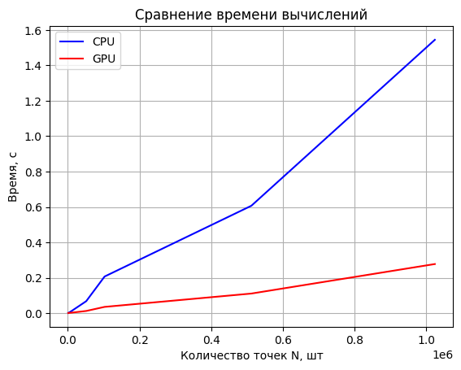
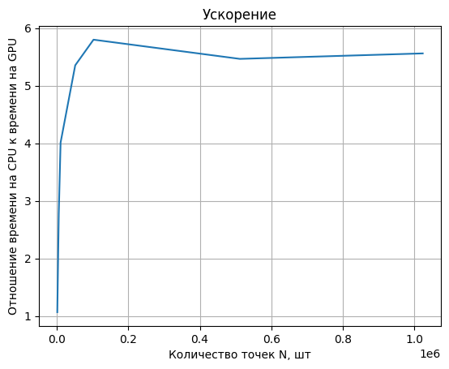

## Описание
Для параллельного вычисления числа π используется библиотека Numba, применяющая генерацию случайных чисел в диапазоне от 0 до 1 с использованием генератора xoroshiro128p.

Процесс вычисления π реализован с помощью функции gpu_pi_calculating, работающей на GPU. В этой функции каждая нить отвечает за генерацию случайных координат точки (x,y). Если выполнено условие: (x^2 +y^2 < 1), то сумма увеличивается на значение 4/N, де 𝑁 — общее количество точек.

​Для вычисления числа π на CPU используется аналогичная функция, но с последовательной реализацией вычислений.

## Вывод
Вычисление числа π методом Монте-Карло с использованием стандартных средств Python значительно медленнее по сравнению с распараллеленной версией на Numba. Это связано с тем, что генерация случайных чисел происходит непосредственно на GPU, что минимизирует затраты на передачу данных между устройствами.