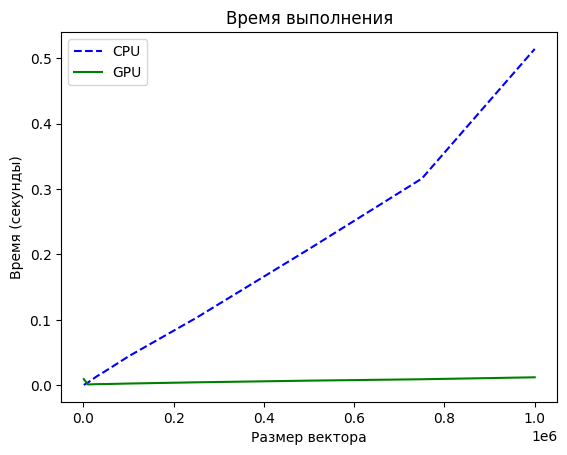
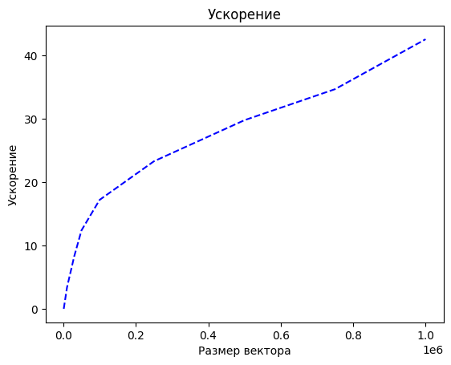

## Задание

Задача: реализовать алгоритм сложения элементов вектора

Язык: C++ или Python

Входные данные: Вектор размером 1 000..1 000 000 значений.

Выходные данные: сумма элементов вектора + время вычисления

Реализация должна содержать 2 функции сложения элементов вектора: на CPU и на GPU с применением CUDA.

Отчет о проделанной лабораторной работе - это git-репозиторий с исходным кодом реализации + описание проделанной работы там же в readme.

Необходимо описать реализацию, объяснив, что конкретно было распараллелено и почему.

Провести эксперименты: получить сумму векторов разных размеров (провести 5 или более экспериментов), посчитать ускорение. Результаты привести в виде таблицы/графика.

## Описание
Генерация векторов с случайными целыми значениями в диапазоне от 0 до 10 заданной размерности с использованием функции generateRandomVector. Выполнение операции сложения векторов на центральном процессоре (CPU) с использованием функции cpuVectorSum. Замер времени выполнения сложения на CPU. Выполнение операции сложения векторов на графическом процессоре (GPU) с использованием функции gpuVectorSum. Замер времени выполнения сложения на GPU. Сравнение результатов сложения, проверка корректности путём сравнения векторов, полученных на CPU и GPU. Вычисление среднего времени выполнения для каждой размерности векторов.
Было распараллелено сложение для вычисления элементов результирующего вектора. Для этого данные из двух входных векторов передавались на устройство (GPU), чтобы все созданные потоки могли выполнить функцию ядра над этими данными. После выполнения вычислений результаты возвращались обратно на хост (CPU). Каждый поток (ядро CUDA) вычислял отдельный элемент результирующего вектора.

## Выводы

На графике времени видно, что GPU значительно превосходит CPU по скорости выполнения операций на больших размерностях векторов, сохраняя почти постоянное время выполнения, в то время как время на CPU растёт линейно. С увеличением размерности векторов ускорение на GPU по сравнению с CPU значительно возрастает, достигая более чем 40 раз на максимальной размерности.
